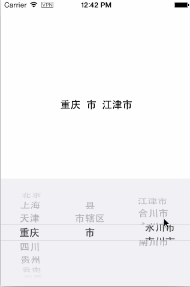

# CNCityPickerView

<p align="center"></p>

A support of Interface Builder and code to create custom very high level Chinese City Selector.

# Usage

Written code.

```Objective-C
// 使用代码的方式添加也行
CGRect pickerViewFrame = CGRectMake(0, self.view.bounds.size.height-180, self.view.bounds.size.width, 180);

// 1、创建
CNCityPickerView *pickerView = [CNCityPickerView createPickerViewWithFrame:pickerViewFrame valueChangedCallback:^(NSString *province, NSString *city, NSString *area) {
   
   _displayLabel.text = [NSString stringWithFormat:@"%@  %@  %@", province, city, area];
   
}];

// 2、可选设置的属性
pickerView.textAttributes = @{NSForegroundColorAttributeName : [UIColor redColor],
							 NSFontAttributeName : [UIFont boldSystemFontOfSize:18.0f]
							 };
pickerView.rowHeight = 30.0f;

// 3、添加到指定视图
[self.view addSubview:pickerView];
```


Use Interface Builder.

```Objective-C
//    _cityPickerView.hidden = YES;
    // 直接拖IB也行哦
    __weak UILabel *displayLabel = _displayLabel;
    [_cityPickerView setValueChangedCallback:^(NSString *province, NSString *city, NSString *area) {
        displayLabel.text = [NSString stringWithFormat:@"%@  %@  %@", province, city, area];
    }];
}
```

# Install
```Ruby
pod 'CNCityPickerView'
```

# License

CNCityPickerView is available under the MIT license.
